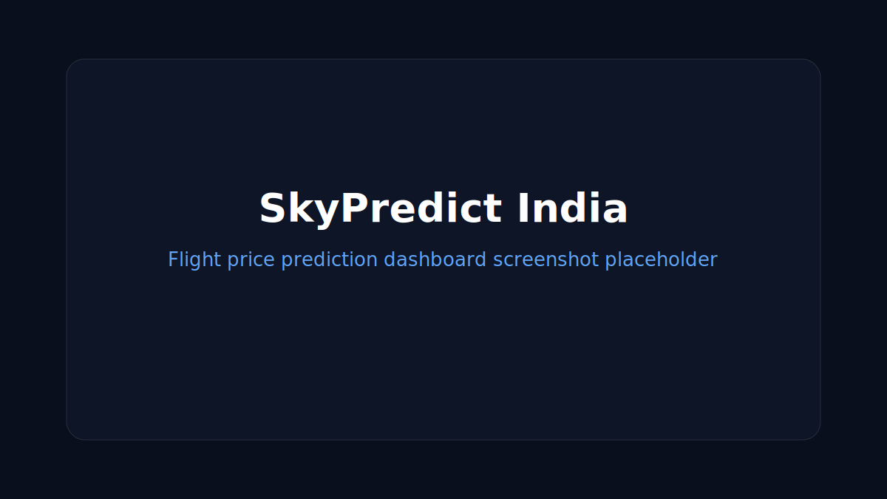

# SkyPredict India

India-first domestic flight price prediction for Phase 1 routes across 82 Indian airports. The app predicts the cheapest travel dates, buy/wait signals, India holiday surges, festive price memory, and a 60-day price trend in INR.



   

## Tech Stack

Frontend: React 18, Vite, Tailwind CSS v3, Recharts, Axios, react-datepicker, react-hot-toast, lucide-react, clsx.

Backend: Python 3.11, FastAPI, Pydantic v2, LightGBM, scikit-learn, pandas, numpy, joblib, redis, holidays, httpx, python-dotenv, MLflow, Optuna, APScheduler, pytest.

## Prerequisites

- Node 20+
- Python 3.11+
- Redis 7+ for caching and 90-day price history
- Docker and Docker Compose, optional

## Quick Start

```bash
git clone https://github.com/lucky12123-1/UdanSmart.git
cd UdanSmart
cp backend/.env.example backend/.env
cd backend
python -m venv .venv
source .venv/bin/activate
pip install -r requirements.txt
uvicorn app.main:app --reload
```

In another terminal:

```bash
cd frontend
npm install
npm run dev
```

Open http://localhost:5173.

## Docker Quick Start

```bash
docker compose up --build
```

The frontend runs on http://localhost:5173 and the backend on http://localhost:8000.

## Training the ML Model

```bash
cd backend
python scripts/train_model.py
```

Training generates 80,000 India-domestic synthetic examples, supplements them with stored Redis prices when available, logs metrics to MLflow, and saves the model to `backend/models/lgbm_model.pkl`.

## Daily Price Fetch Setup

The backend schedules the daily fetch at 00:30 IST through APScheduler. For a system cron alternative:

```cron
30 0 * * * cd /path/to/UdanSmart/backend && /path/to/python scripts/fetch_skyscanner_prices.py >> logs/price_fetch.log 2>&1
```

The Skyscanner integration works without keys by attempting the public browse endpoint and falling back to deterministic simulation. A RapidAPI key can be supplied with `SKYSCANNER_RAPIDAPI_KEY`.

## Project Structure

```text
frontend/      React + Vite app
backend/       FastAPI app, ML pipeline, services, tests, data
.github/       CI workflow
docker-compose.yml
```

## API Endpoints

| Method | Endpoint | Description |
|---|---|---|
| GET | /api/health/ | Service status, model version, airport count, price store metadata |
| GET | /api/airports/ | All 82 India airports |
| GET | /api/airports/search?q=BOM | Top 8 airport matches |
| GET | /api/airports/routes | Valid India domestic route pairs |
| POST | /api/predict/ | Price prediction, calendar, trend, festive reference |

## Environment Variables

| Variable | Default | Description |
|---|---|---|
| APP_NAME | SkyPredict India | App display name |
| DEBUG | True | Enables debug mode |
| REDIS_URL | redis://localhost:6379 | Redis connection |
| MODEL_PATH | models/lgbm_model.pkl | Serialized LightGBM model |
| SKYSCANNER_RAPIDAPI_KEY | empty | Optional RapidAPI Skyscanner key |
| PRICE_STORE_TTL_DAYS | 90 | Rolling price store TTL |
| FESTIVE_ARCHIVE_PATH | data/festive_prices_archive.json | Historical festive archive |
| CACHE_TTL_SECONDS | 21600 | Prediction cache TTL |
| DAILY_FETCH_CRON | 30 19 * * * | 00:30 IST expressed in UTC cron |

## Adding Indian Airports or Routes

Add the airport to `backend/data/airports_india.json` with IATA, state, lat/lon, and timezone. Then add a base fare in `backend/app/ml/features.py` for every direct route that should be considered operational. The frontend airport search reads from its India-only airport constant and should be kept aligned.

## Skyscanner Notes

`SkyscannerService` tries the no-key browse endpoint first and gracefully returns `None` on missing data or HTTP errors. The predictor then uses deterministic India-calibrated simulation, so the application works end to end without any external API key.

## Phase 2 Roadmap

- International routes from India
- Airline-specific fare class availability
- Real booking handoff tracking
- More historical route memory and city-pair alternatives

## Contributing

Open a branch, run backend tests and the frontend build, then submit a pull request. Keep Phase 1 scoped to India domestic routes only.

## License

MIT
